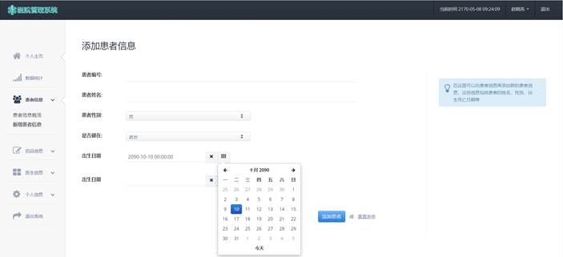

# 面向医生的医院信息管理系统

## 项目背景

> 心力衰竭疾病是当下一种常见疾病，本项目以心力衰竭疾病作为切入点，设计面向医院的管理系统。具体基本需求包含以下几点：
>
> * 建立面向医生端的管理平台，设计面向医院就诊使用的数据库；
> * 管理平台要求医生能够增加/删除/修改/删除病人的数据信息；
> * 增加群体筛选功能，如针对年龄、性别、诊断信息等进行数据筛选并展示筛选后的数据；
> * 筛选之后的患者能够进行详细数据查看，且可以进行群体信息分布展示(如采用条形图等展示年龄分布)；
> * 完成后端数据库及前端页面展示
> * 注册登录、不同医生的权限控制功能等；
> * 将数据库部署于云服务器；
> * 采用APP或web端开发系统；

## 项目功能介绍

* 患者管理与筛选
  * 支持对患者基本信息、就诊、检查、化验信息进行增删改查
  * 支持根据患者姓名、性别、年龄、诊断信息对患者筛选
  * 支持根据姓名对医生进行筛选
  * 支持根据药品名称对药品筛选

* 数据可视化

  * 用于患者信息可视化，既支持对所有患者数据的可视化，也支持对按条件筛选后的患者信息可视化展示

    > * *在患者信息搜索页面经过筛选后点击“查看患者数据统计”按钮，亦可跳转至此页面，此时显示被筛选部分的患者信息可视化图。且此时在此页面上添加了“返回患者信息概览”按钮，帮助医生快速返回搜索患者页*
    > * *直接在侧边栏打开时，默认显示全体患者信息的可视化图，此时不会出现返回搜索页按钮。*

  * 显示患者性别、年龄与来诊月份的可视化展示

* 用户交互的友好性优化

  * 在日期和时间输入框分别使用了datepicker及datetimepicker控件，提高用户友好性
  * 在出现一些可被预料的错误时通过flash消息向用户提示错误，提升用户体验
  * 部分页面根据用户的不同登录状态和不同身份（是否管理员）显示不同信息，提升用户体验
  * 部分界面通过基于Bootstrap的Modal模态框实现浮窗效果，提升UI整体美感

* 药品信息管理

  * 在MIMIC数据库之外设置了drug表，用于记录医院药品信息数据库
  * 开发了医院药品信息管理模块，更贴合医院处方系统实际情况
  * 在医生开处方时，药品数据库中对应药品数量减1，在医生修改处方时，药品数据库中对应药品数量也会变化

* 医生账户管理与账户权限控制

  * 在MIMIC数据库之外设置了user表，包含管理员账户及普通医生账户两种类型

  * 实现对不同账户注册登录后的不同权限控制，对不同账户权限的控制从前端和后端两个角度实现

    > * *前端实现的权限控制：读取session中账户信息并判断是否为管理员账户后，前端界面由jinja2模板引擎分别进行不同方式的渲染，借此实现不同账户登陆后前端界面显示的差异，即非管理员账户在前端看不到仅管理员可用的功能*
    > * *后端实现的权限控制：每次打开需要管理员账户才能使用的功能对应的路由时，都会读取session中账户信息，如不是管理员，则系统会强制跳转至首页，即非管理员账户即使在前端输入了仅管理员可用的功能对应的URL也无法使用对应功能*

  * 出于安全设计，医生账户密码均为MD5加密后保存，密码不在后台明文保存，提高系统安全性

  * 账户控制逻辑如下：

    

* 数据库云端部署

  * 本项目MySQL数据库部署于华为云服务器

    *注：云服务器公网IP已释放，因而GitHub上开源版本代码是通过连接本地MySQL服务器操作的*

* 本项目中MIMIC数据库中数据表关系E-R图如下


## 项目技术栈

Python、MySQL、jQuery、Bootstrap、Flask、HTML、JavaScript、CSS等

## 项目结构

```python
-static #存放CSS、JavaScript、img文件等前端素材
    -css
    -font
    -img
    -js
-templates #存放各个模板页面
-app.py #主程序
-config.py #存放数据库配置信息
```

## How To Run

* Download / Git Clone This Project

* Import the MySQL file `hospital.sql`

  > ***Note:***
  > *You can get the `hospital.sql` from https://pan.baidu.com/s/1mmk0TMSWtJTepfQ0u8CTew by using the password `thzg`*

* Configure

  > ```json
  > {
  >   "database": "hospital.sql",
  >   "port": 3306,
  >   "host": "127.0.0.1"
  > }
  > ```

* Run `python app.py` in the console

* Enjoy the Project

  > Initial account information
  >
  > * Administrator account:
  >   User name: admin, password: admin
  >
  > *Note:You can use these two accounts to log in to the system. After logging in, you can modify the permissions of other doctor accounts*

## 界面介绍

### 登录页面

页面描述：用于登录时使用

对应后端接口：`Login()`

功能描述：用于在用户登录时在前端显示，引导用户在前端输入用户账户信息，核对密码并完成登陆。以浮窗形式展现在首页上。在登录信息输入后，根据用户信息的正确性，引导用户返回首页并提示登陆成功或登陆失败信息。

界面截图：


图 1 登录页面示意图


图 2 登录失败时消息提醒


图 3 登录成功时消息提醒

### 首页

页面描述：用于登录前的首页

对应后端接口：`Index()`

功能描述：用于在用户登录前在前端显示，引导用户登录系统，同时提供较为优美的UI设计，提高交互性。

界面说明：如下图所示，界面主体为多张图片组成的轮播图Banner，可左右拖动轮播图图片，提高界面美观性，优化了用户交互体验。同时在右上角和轮播图上提供用户登录选项，点击相应选项即可跳转至登录页面；在右上角点击注册按钮即可跳转至注册页面。在用户登录后，右上角的注册于登录按钮改变为个人中心按钮和退出按钮，分别用于指向医生后台首页和退出医生的个人登陆。图片上的“现在登录”也变为“个人中心”字样。

界面截图：


图 4 用户登录前的首页示意图


图 5 用户登录后的首页示意图

### 注册页面

页面描述：用于注册时使用

对应后端接口：`Register()`

功能描述：用于在用户注册时在前端显示，引导用户在前端输入用户账户信息并注册。以浮窗形式展现在首页上。在登录信息输入后，根据用户信息的正确性，引导用户返回首页并提示注册是否成功。注册界面输入用户生日的部分引入了datepicker插件，提高了

界面截图：


图 6 注册界面示意图


图 7 注册成功时消息提醒


图 8 用户名重复导致注册失败时消息提醒


图 9 医生编号重复导致注册失败时消息提醒


图 10 注册界面datepicker插件示意图

### 医生个人主页

页面描述：用于医生登陆后进入个人中心时显示，主要展示医生可进行的操作和基本的患者信息。

对应后端接口：`Home()`

功能描述：用于医生登陆后进入个人中心时显示，主要展示医生可进行的操作和基本的患者信息。在个人中心前端设计中，主要的工作在于设计出一个基本的页面模板以确定登陆后个人中心各个界面的前端整体风格，而在其它页面中只需要对页面模板的复用，这将能更好地维护前端页面风格的统一性。此外还需要注意根据登录用户是否为管理员账户，对侧边栏中的功能按键进行不同的渲染，以实现不同用户显示不同前端页面，这是实现用户权限控制的策略中的一部分。在页面左侧侧边栏分别显示了登陆后可进行的若干操作，界面右上角显示登陆的医生姓名，并设置有退出按钮，此外还有当前系统时间（注意：根据之前实验时的假定，今年为2170年）。

在页面主体部分首先显示了数据库中患者总人数、今天仍然在医院的患者人数、系统中医生账户数、系统中药品种类数。下方有近日在诊患者数目统计的可视化示意图和当前医院内仍就诊中的患者信息简表（**当前仍处于就诊状态的患者定义为：入院时间小于服务器时间且出院时间大于服务器时间的患者，考虑到MIMIC数据库中时间数据并非真实数据，因此此处不考虑患者是否死亡，也即即便是患者已经死亡，只要当前系统时间仍然小于患者出院时间，就认为患者仍处于就诊状态。此处服务器时间为真实时间向后推后150年得到**），如图12所示，将鼠标拖动到可视化示意图上方，将详细展示当天在院患者总数。

**管理员和普通医生登陆后，左侧侧边栏功能模块存在细微差别，具体在于非管理员账户只能查看药品信息而不能修改，非管理员账户不能查看及修改其他医生账户的信息。**登陆后的界面右上角，显示用户姓名的位置可以唤起下拉菜单，界面左侧侧边栏同样设计了下拉菜单，详见图13所示，这样的设计提高了交互性和美观度。

界面截图：


图 11 管理员登录后界面示意图


图 12 非管理员的普通医生登录后界面示意图


图 13医生个人中心中的下拉菜单示意图

### 医生个人信息查询

页面描述：用于医生登陆后进入个人中心时查询个人基本信息时显示

对应后端接口：`SearchUserInfo()`

功能描述：用于医生登陆后查询个人信息时使用

界面截图：


图 14 医生个人信息查询界面示意图

### 医生账户密码修改

页面描述：用于医生登陆后进入个人中心时修改密码

对应后端接口：`ChangeUserPassword ()`

功能描述：用于医生登陆后修改个人密码信息时使用，如忘记密码，则需要管理员后台修改，而不能在此处修改

界面截图：


图 15 医生账户密码修改界面示意图

### 医生个人信息修改

页面描述：用于医生登陆后进入个人中心时修改个人基本信息时显示

对应后端接口：`ModifyUser ()`

功能描述：用于医生登陆后修改个人信息时使用，只能修改部分信息，如需修改其他信息，需要管理员后台修改。日期修改部分引入`datepicker`组件，优化交互体验。

界面截图：


图 16 医生个人信息修改界面示意图

### 药品信息添加

页面描述：用于管理员登陆后添加药品信息时使用

对应后端接口：`AddDrug()`

功能描述：用于管理员登陆后添加药品信息时使用，普通医生无法使用此功能，一方面，普通医生的后台将无法看到此模块，另一方面，如果普通医生输入了对应的路由，也会被识别到是非管理员账户而被强制退出此模块。

界面截图：


图 17 药品信息新增界面示意图

### 医生信息添加

页面描述：用于管理员登陆后添加医生信息时使用

对应后端接口：`AddUser()`

功能描述：用于管理员登陆后添加医生信息时使用，普通医生无法使用此功能，一方面，普通医生的后台将无法看到此模块，另一方面，如果普通医生输入了对应的路由，也会被识别到是非管理员账户而被强制退出此模块。日期输入部分引入datepicker组件，优化交互体验。

界面截图：


图 18 医生信息新增界面示意图

### 医生信息查看

页面描述：用于管理员登陆后查看医生信息时使用

对应后端接口：`SearchUser()`

功能描述：用于管理员登陆后查看医生信息时使用，普通医生无法使用此功能，一方面，普通医生的后台将无法看到此模块，另一方面，如果普通医生输入了对应的路由，也会被识别到是非管理员账户而被强制退出此模块。

在界面的搜索框中输入医生姓名后回车，即可模糊查找含有该姓名的医生，每页显示五个医生信息，分页是在后台实现的，也即后台每次传5个医生信息给前端，前端根据后端数据进行渲染，此处依靠了paginate对象实现。

界面截图：


图 19 医生信息查看界面示意图


图 20 在输入框中搜索“李”后返回的医生信息查看界面示意图

### 管理员修改用户信息

页面描述：用于管理员登陆后修改医生信息时使用

对应后端接口：`ModifyUserByAdmin()`

功能描述：用于管理员登陆后修改医生信息时使用，普通医生无法使用此功能，一方面，普通医生的后台将无法看到此模块，另一方面，如果普通医生输入了对应的路由，也会被识别到是非管理员账户而被强制退出此模块。此处可修改医生关键信息，这些信息不能由医生本人直接修改，只能由管理员修改。其中日期修改部分引入了datepicker模块，优化交互体验.

界面截图：


图 21 管理员登录后修改其他用户信息界面示意图

### 药品信息查询

页面描述：用于管理员与普通医生查询药品信息时展示

对应后端接口：`SearchDrug()`

功能描述：用于查询药品信息时使用，普通医生与管理员登陆后界面显示不同，这样的权限控制是基于读取session中的账户信息并判断是否为管理员账户后，再由jinja2模板引擎分别进行不同方式的渲染实现的，可以看到，与管理员相比，普通医生不能进行药品信息添加和删除。

界面截图：


图 22 管理员登录后药品信息查看界面示意图


图 23 普通医生登录后药品信息查看界面示意图


图 24 药品搜索结果界面示意图

### 药品信息修改

页面描述：用于管理员修改药品信息时展示

对应后端接口：`ModifyDrug()`

功能描述：用于管理员登陆后修改药品信息时使用，普通医生无法使用此功能，一方面，普通医生的后台将无法看到此模块，另一方面，如果普通医生输入了对应的路由，也会被识别到是非管理员账户而被强制退出此模块。此处可修改药品名称、类型、库存量等。

界面截图：


图 25 药品信息修改界面示意图

### 患者信息查询

页面描述：用于医生/管理员查询患者信息时展示

对应后端接口：`SearchPatient()`

功能描述：用于医生查询患者信息，支持患者信息按条件筛选。点击“查看患者数据统计”按钮，跳转到被筛选后的患者数据统计界面。

界面截图：


图 26 患者信息查询界面示意图


图 27 按姓名含“李”、性别为女、年龄为64岁、诊断信息含“HEART”患者搜索结果示意图

### 患者信息新增

页面描述：用于医生/管理员新增患者信息时展示

对应后端接口：`AddPatient ()`

功能描述：用于医生新增患者信息。

界面截图：



图 28 患者信息新增界面示意图

### 患者处方信息查看

页面描述：用于医生/管理员查看患者处方信息时展示

对应后端接口：`SearchPatientPrescription()`

功能描述：用于医生查询患者处方信息，每页显示15条处方信息，点击“新增处方信息”按钮触发浮窗，浮窗中时间选择部分更换为了datepicker组件的输入框，提高了用户友好性。

界面截图：


图 29 患者处方信息查询界面示意图


图 30 患者处方信息查询界面-新增处方信息浮窗示意图

### 患者就诊信息展示

页面描述：用于医生/管理员查询患者就诊信息时展示

对应后端接口：`SearchPatientAdmissions()`

功能描述：用于医生查询患者就诊信息，点击“编辑患者信息”及“新增就诊记录”，则会弹出对应弹窗，可在对应弹窗内输入相应信息并提交，这两个弹窗分别调用了后端的ModifyPatient()和AddPatientAdmissions()接口。时间输入引入了datetimepicker控件，患者入院时间和出院时间初始值为服务器当前时间。（当前UTC时间推后150年得到）

界面截图：


图 31 患者就诊信息查询界面示意图


图 32 患者就诊信息查询界面示意图-患者信息修改浮窗


图 33 患者就诊信息查询界面示意图-患者就诊信息新增浮窗

### 患者化验项目信息修改

页面描述：用于医生/管理员修改患者检查项目信息时展示

对应后端接口：`ModifyPatientLabevents()`

功能描述：供医生及管理员账户修改患者病历中的化验项目信息

界面截图：


图 34 患者化验项目修改界面示意图

### 患者化验信息查看

页面描述：用于医生/管理员查看患者化验信息时展示

对应后端接口：`SearchPatientLabevents()`

功能描述：用于医生查询患者检查信息，每页显示15条检查信息，点击“新增检查项目”按钮触发浮窗，浮窗中时间选择部分更换为了datepicker组件的输入框，提高了用户友好性。

界面截图：


图 35 患者化验信息查询界面-新增化验项目浮窗示意图


图 36 患者化验信息查询界面示意图

### 患者处方信息修改

页面描述：用于医生/管理员修改患者处方信息时展示

对应后端接口：`ModifyPatientPrescription()`

功能描述：本页面供医生及管理员账户修改患者病历中的处方信息，直接修改所需修改的项目即可。药物名称须与数据库中名称对应。在药品名称正确的情况下系统会根据drug数据库自动补全部分药品信息。

界面截图：


图 37 患者处方信息修改界面示意图

### 患者数据统计可视化

页面描述：用于医生/管理员查询患者数据可视化界面时展示

对应后端接口：`Visuallize()`

功能描述：用于医生查询患者可视化信息，当直接在导航栏打开时，默认显示全体患者信息的可视化图，在患者信息搜索页面经过筛选后点击“查看患者数据统计”按钮，亦可跳转至此页面，此时显示被筛选部分的患者信息可视化图。

如图39所示，在患者搜索页搜索姓名含“白”的患者后点击“查看患者数据统计”选项卡，即可跳转至对先前搜索结果进行数据可视化的页面，且在此页面上添加了“返回患者信息概览”按钮，帮助医生快速返回搜索患者页，而在导航栏中直接进入数据统计界面，查看全体患者信息可视化时，则不会出现这个返回按钮。

界面截图：


图 38 患者数据可视化界面示意图


图 39 在患者搜索页搜索姓名含“白”的患者后跳转到患者数据可视化界面的示意图

### 患者就诊信息修改

页面描述：用于医生/管理员修改患者就诊信息时展示

对应后端接口：`ModifyPatientAdmission()`

功能描述：本页面供医生及管理员账户修改患者病历中的就诊信息，直接修改所需修改的项目即可。

界面截图：


图 40 患者就诊信息修改界面示意图


图 40 患者就诊信息修改界面示意图（续）

### 患者检查项目信息修改

页面描述：用于医生/管理员修改患者检查项目信息时展示

对应后端接口：`ModifyPatientDatatimeevent()`

功能描述：供医生及管理员账户修改患者病历中的检查项目信息

界面截图：


图 41 患者检查项目修改界面示意图

### 患者检查信息查看

页面描述：用于医生/管理员查看患者检查信息时展示

对应后端接口：`SearchPatienDatatimeevent ()`

功能描述：用于医生查询患者检查信息，每页显示15条检查信息，点击“新增检查项目”按钮触发浮窗，浮窗中时间选择部分更换为了datepicker组件的输入框，提高了用户友好性。

界面截图：


图 42 患者检查信息查询界面-新增检查项目浮窗示意图


图 43 患者检查信息查询界面示意图